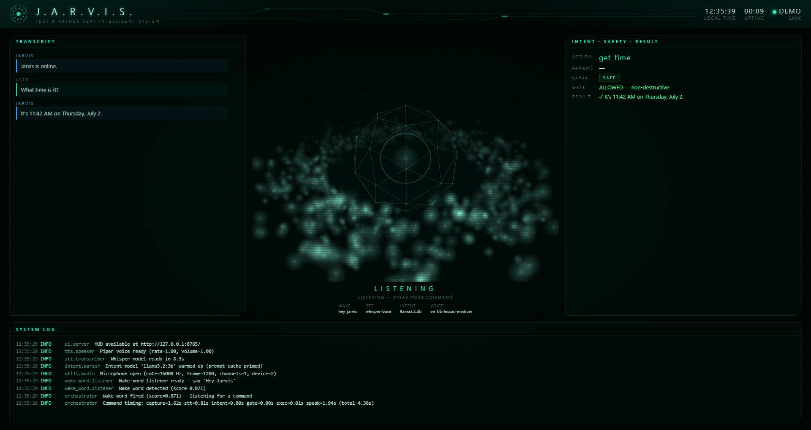
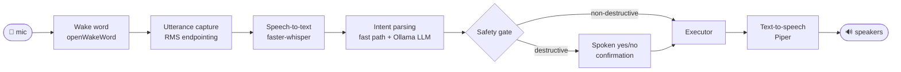
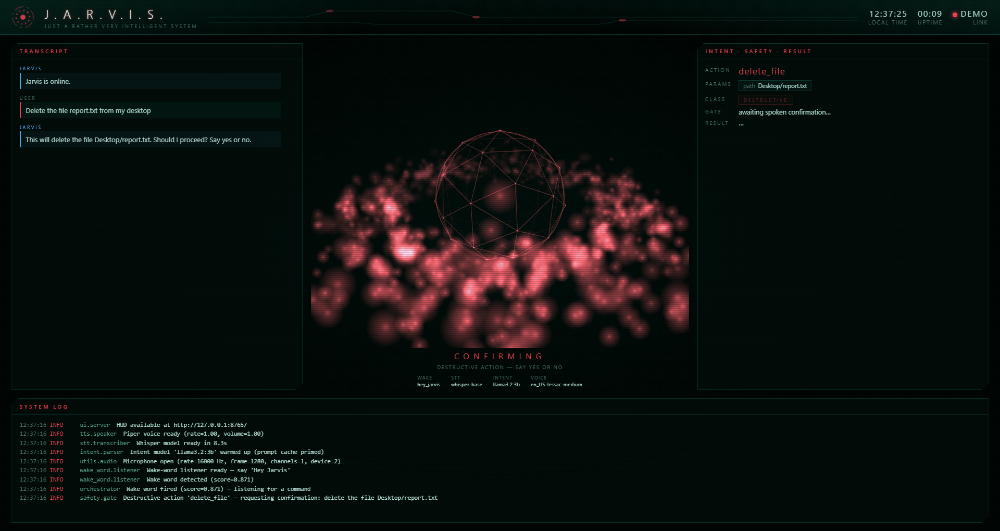

# J.A.R.V.I.S — a fully local, offline voice assistant for Windows

> *Just A Rather Very Intelligent System.* Say **"Hey Jarvis"**, speak a command in natural
> language, and it opens apps, manages files, searches the web, and controls your system —
> with every byte of audio and every model running **on your machine**. Nothing leaves the device.



## Highlights

- **100% local & offline** — wake word, speech-to-text, intent parsing (local LLM), execution,
  and text-to-speech all run on-device. No cloud APIs, no telemetry, no audio ever uploaded.
- **Destructive-action guardrail, enforced in code** — deleting, overwriting, moving files,
  killing processes, shutting down: all demand an explicit spoken **yes** first. Silence,
  mumbling, or "no, don't do it" mean **deny**. Non-destructive commands run instantly.
- **Iron-Man-style HUD** — a live browser dashboard with a particle-sphere core that reacts to
  your voice, a running transcript, the parsed intent with its safety verdict, and streaming logs.
- **Production-ready service** — supervised auto-restart with backoff, single-instance guard,
  Windows Task Scheduler integration, structured rotating logs, fully config-driven.
- **Snappy on plain CPUs** — a regex fast path answers common commands without touching the LLM,
  the LLM's prompt cache is primed at startup, and every command logs per-stage timings.
- **Spoken live answers** — "what's the latest news?" reads the top headlines aloud;
  "when is the next Formula 1 race?" fetches search snippets and the **local** LLM speaks a
  one-line answer. The lookup query is the only thing that ever goes online, and
  `web_answers.enabled: false` turns it off entirely (falls back to a browser search).

## The pipeline



Every stage is a separate module under [`src/jarvis/`](src/jarvis), configured from
[`config/config.yaml`](config/config.yaml), and the **action catalog**
([`src/jarvis/actions.py`](src/jarvis/actions.py)) is the single source of truth for what the
assistant can do and which actions count as destructive.

## The safety model

| Class | Examples | Behavior |
|---|---|---|
| Non-destructive | open app, web search, read file, volume, lock screen | executes immediately |
| **Destructive** | delete/overwrite/move file, kill process, shutdown, restart, `run_command` | **spoken confirmation required** |
| Unknown/uncataloged | anything the LLM invents | fail-safe: confirm or refuse |

The gate lives in [`src/jarvis/safety/gate.py`](src/jarvis/safety/gate.py). Refusal is the
default: mixed signals ("no, don't do it"), silence, unclear replies, and exhausted retries all
**deny**. Arbitrary shell execution (`run_command`) is additionally disabled in config by default.


*A destructive command turns the core red and holds execution until you say "yes".*

## Quickstart

### Prerequisites

- **Windows 11**, **Python 3.12**, a microphone and speakers
- **[Ollama](https://ollama.com)** for local intent parsing:

```powershell
winget install Ollama.Ollama
ollama pull llama3.2:3b
```

### Install

```powershell
git clone https://github.com/sindhujamallappa/J.A.R.I.V.S.git
cd J.A.R.I.V.S
py -3.12 -m venv .venv
.venv\Scripts\python -m pip install -r requirements.txt
```

### Run

```powershell
.venv\Scripts\python -m src.jarvis.main
```

First start downloads the models once (openWakeWord ≈ 8 MB, Whisper `base` ≈ 145 MB into
`models/whisper/`, Piper voice ≈ 60 MB into `models/piper/`) — subsequent starts are fully
offline. The HUD opens at **http://127.0.0.1:8765/** automatically; wait for the spoken
*"Jarvis is online."*, then talk:

Jarvis answers every wake word with a spoken **"Yes Boss"** (configurable via
`wake_word.ack_phrase`), then listens.

| Say | What happens |
|---|---|
| "Hey Jarvis … what time is it?" | speaks the time (instant fast path) |
| "… what's the latest news?" / "any news about cricket?" | reads the top 3 headlines aloud |
| "… when is the next Formula 1 race?" | speaks a one-line answer (web snippets + local LLM) |
| "… open notepad" / "close notepad" | launches / gracefully closes the app |
| "… search the web for llama 3" | opens your browser on the search |
| "… set volume to 40" / "mute" / "lock my screen" | system controls |
| "… read the file notes.txt on my desktop" | reads it aloud |
| "… delete the file report.txt from my desktop" | **asks for a spoken yes/no first** |

`Ctrl+C` stops it. Tune anything — mic device, wake threshold, models, voice — in
[`config/config.yaml`](config/config.yaml); a few keys can be overridden per-run via
[`.env`](.env.example).

### Run as a background service (starts at logon)

```powershell
.venv\Scripts\python -m src.jarvis.service install     # register the Task Scheduler entry
.venv\Scripts\python -m src.jarvis.service status      # check it
.venv\Scripts\python -m src.jarvis.service uninstall   # remove it
```

The service wraps the same pipeline in a supervisor: auto-restart with exponential backoff,
a single-instance mutex so two copies never fight over the microphone, and hidden-window launch.

## The HUD

A zero-dependency local dashboard (stdlib HTTP + Server-Sent Events, **loopback only**) that
renders what the assistant is doing in real time:

- **The core** — a wireframe icosphere in a turbulent particle ring. It tilts toward your mouse,
  pulses on wake, gets agitated by your live mic level, spins amber while the LLM thinks, and
  pulses **red** while a destructive action awaits your confirmation. Click it for a shockwave.
- **Transcript** — everything you said and everything Jarvis answered.
- **Intent · Safety · Result** — the parsed action, its parameters, a SAFE/DESTRUCTIVE badge,
  the gate verdict, and the execution result.
- **System log** — live, color-coded structured logs, including per-command stage timings.

**Presenting without the assistant running?** Open the HUD in demo mode — it self-populates
with a canned scene:

```text
http://127.0.0.1:8765/?demo=1                    (while JARVIS runs)
src/jarvis/ui/static/index.html?demo=1           (straight from disk, no server)
src/jarvis/ui/static/index.html?demo=1&state=confirming   (the red safety scene)
```

## Demo script (5 minutes)

1. Start JARVIS, show the HUD connecting and *"Jarvis is online."*
2. **"Hey Jarvis — what time is it?"** → instant fast-path answer; point at the
   `intent=0.00s` in the timing log line.
3. **"Hey Jarvis — search the web for UiPath"** → browser opens; show the intent card.
4. **"Hey Jarvis — delete the file demo.txt from my desktop"** → core turns red, JARVIS asks
   for confirmation. Say **"no"** → *"Okay, cancelled."* — nothing touched.
5. Repeat and say **"yes"** → file lands in the Recycle Bin (never hard-deleted by default).
6. Kill the terminal mid-run and restart via the service — supervised recovery.

## Development

```powershell
.venv\Scripts\python -m pytest -q          # 150+ tests, no audio hardware needed
```

```text
src/jarvis/
├── main.py            entrypoint (single-instance guard + HUD + pipeline)
├── service.py         supervisor + Task Scheduler install/uninstall/status
├── orchestrator.py    wires the loop; owns the mic; per-stage timings
├── actions.py         action catalog: params + destructive classification
├── config.py          typed, validated config (config/config.yaml + .env)
├── wake_word/         openWakeWord listener ("hey jarvis")
├── stt/               utterance capture (RMS endpointing) + faster-whisper
├── intent/            regex fast path + Ollama LLM parser (catalog-validated)
├── safety/            spoken-confirmation gate (deny by default)
├── execution/         the 25 cataloged actions (send2trash, pycaw, live web answers, …)
├── tts/               Piper speaker (SAPI fallback)
├── ui/                event bus + SSE server + the HUD page
└── utils/             audio I/O, logging setup
```

Key troubleshooting, learned the hard way:

- **Wake word never fires** → check which mic Windows defaults to; pin yours via
  `audio.input_device` (name substring or index). The HUD's reactor glow shows live mic level.
- **"I didn't hear a command"** → the capture log now prints `peak rms` vs. the onset
  threshold; lower `stt.min_rms_threshold` for quiet mics.
- **Slow first command** → keep `intent.keep_alive` set (the model unloads after ~5 idle
  minutes otherwise) and leave warm-up enabled; watch `Command timing:` lines to find the
  bottleneck.

## Privacy

Microphone audio is processed in memory and never written to disk or network. The LLM runs on
`localhost` via Ollama. The HUD binds to `127.0.0.1` only. Model files download once from
public repositories (openWakeWord, HuggingFace, Piper voices) on first run; after that the
assistant runs with the network cable unplugged.

One deliberate exception: when you ask a **live question** (news, schedules, current facts),
that query — and nothing else — is fetched over HTTPS (Google News RSS for headlines; Bing or
DuckDuckGo HTML for snippets, configurable) and summarized by the *local* LLM. Disable it with
`web_answers.enabled: false` to stay 100% offline; those requests then just open a browser search.

## Roadmap

- GUI automation actions (pyautogui) — "click the save button"
- Optional enterprise execution backend (UiPath) for complex automations — explicitly
  out of the runtime voice loop
- Custom wake-word training, more voices, multi-language STT
